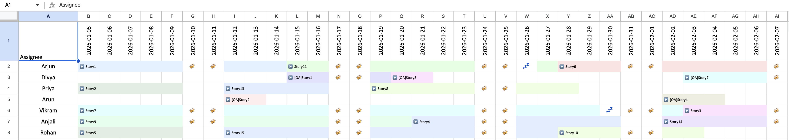

# Node.js Task Scheduler



A Node.js application for scheduling tasks across multiple assignees, iterations, and generating Excel reports with task distribution and timeline views.

## Features

- **Task Scheduling**: Automatically schedules tasks per assignee based on deadlines, story points, and working days.
- **Iteration Management**: Assigns tasks to iterations (time-based buckets) while respecting capacity.
- **Status Tracking**: Calculates task status (On Track, At Risk, Unscheduled) based on deadlines.
- **Excel Output**: Generates two Excel files:
  - `TaskScheduleOutput.xlsx`: Task distribution with details.
  - `TaskScheduleTimeline.xlsx`: Visual timeline with color-coded stories.
- **Configuration**: External config file for assignees, iteration settings, and project parameters.
- **Date Handling**: Supports Excel date formats and working day calculations.

## Setup

1. Install dependencies:

   ```bash
   npm install
   ```

2. Prepare input file `TaskInfo.xlsx` with a sheet named "Tasks" containing columns:
   - taskId
   - taskName
   - assignee
   - storyPoints
   - duration (in days)
   - deadline (Excel date number)
   - offDays (array of dates)

3. Configure `config.json`:
   ```json
   {
     "PROJECT_START_DATE": "2026-01-05",
     "DEVELOPERS": ["Arjun", "Priya", "Vikram", "Anjali", "Rohan"],
     "QAS": ["Divya", "Arun"],
     "MAX_ITERATIONS": 3,
     "ITERATION_DURATION": 15,
     "MAX_DATE_LOOKAHEAD": 30,
     "INPUT_FILE": "TaskInfo.xlsx",
     "OUTPUT_FILE": "TaskScheduleOutput.xlsx",
     "OFF_DAYS": {
       "Arjun": ["2026-01-26", "2026-03-08"],
       "Priya": ["2026-02-15", "2026-04-14"],
       "Vikram": ["2026-01-30", "2026-03-15"],
       "Anjali": ["2026-02-20", "2026-04-10"],
       "Rohan": ["2026-01-25", "2026-03-12"],
       "Divya": ["2026-02-18", "2026-04-16"],
       "Arun": ["2026-01-28", "2026-03-18"]
     }
   }
   ```

## Usage

Run the scheduler:

```bash
node index.js
```

Or provide a project start date (overrides config):

```bash
node index.js 2026-01-05
```

This will:

- Read tasks from the configured `INPUT_FILE` (default: `TaskInfo.xlsx`)
- Schedule tasks for DEVELOPERS and QAS
- Generate the configured `OUTPUT_FILE` (default: `TaskScheduleOutput.xlsx`)
- Apply OFF_DAYS from the configuration

## Output Files

### TaskScheduleOutput.xlsx

Contains a "Task Distribution" sheet with:

- Epic No
- Story
- Assignee
- Iteration
- Start Date
- End Date
- Deadline (formatted as YYYY-MM-DD)
- Status

### TaskScheduleTimeline.xlsx

Visual timeline with:

- Rows for each assignee
- Columns for each date
- Color-coded cells for task durations (same color for same story)
- Story names in cells

## Configuration

Edit `config.json` to customize:

- `PROJECT_START_DATE`: Project start date (YYYY-MM-DD format, or pass as command argument)
- `DEVELOPERS`: List of developers
- `QAS`: List of QA team members
- `MAX_ITERATIONS`: Maximum number of iterations (default 3)
- `ITERATION_DURATION`: Days per iteration (default 15)
- `MAX_DATE_LOOKAHEAD`: Maximum days to look ahead for scheduling (default 30)
- `INPUT_FILE`: Path to input Excel file with tasks
- `OUTPUT_FILE`: Path to generated output Excel file
- `OFF_DAYS`: Object mapping assignee names to arrays of off-day dates (YYYY-MM-DD format)

## Dependencies

- `xlsx`: For reading/writing Excel files
- `exceljs`: For advanced Excel formatting (timeline)
- `dayjs`: For date manipulation

## Algorithm

1. Sort tasks by deadline
2. For each assignee:
   - Schedule tasks sequentially, assigning to iterations based on start date
   - Respect working days and off-days
   - Mark overdue tasks and calculate status
3. Generate Excel reports

## Status Values

- **On Track**: Task ends before deadline
- **At Risk**: Task ends within 7 days of deadline
- **Unscheduled**: Task couldn't fit within max iterations
